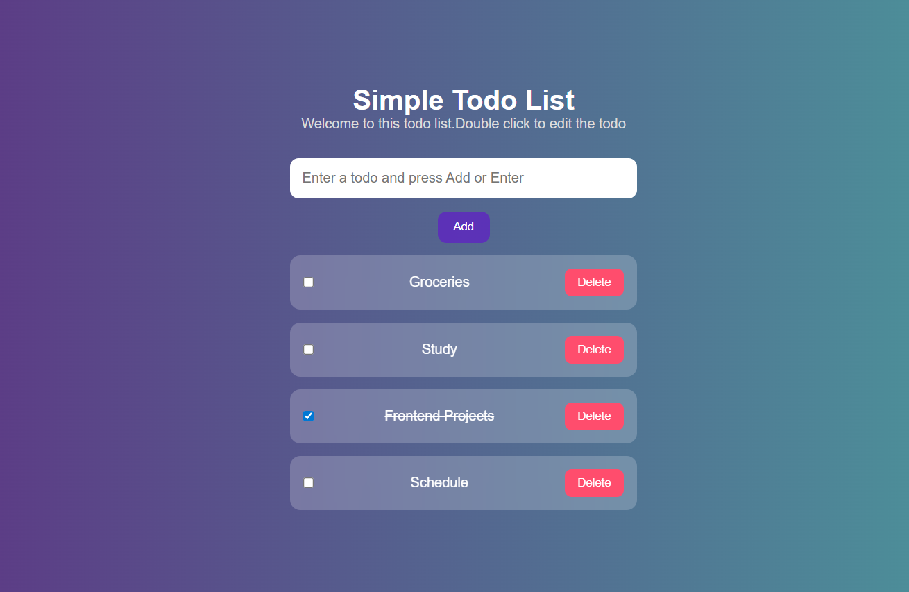

# Simple Todo List App

Responsive Todo List web app built with HTML, CSS, and JavaScript featuring task creation, editing, completion, and deletion.

## Features
- Add new Tasks
- Delete tasks
- Mark task as completed
- Double click to edit task
- Modern UI design
- Responsive layout

## Technologies used
- HTML5
- CSS3
- JavaScript

## Project Screenshot

## How to Run the Project
1. Download or clone the repository
2. open the project folder in VS Code
3. open 'index.html'.
4. Run with Live server

## Future Improvements
- Local storage support
- Dark Mode
- Task Categories
- Due dates
- Firebase backend

## Author
Made by Nausheen Saifi
